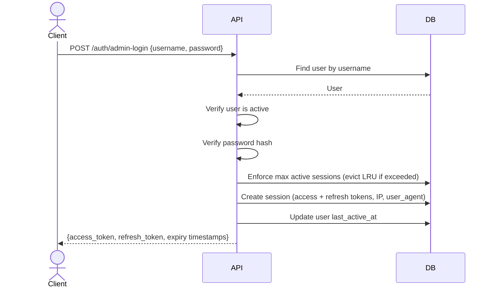
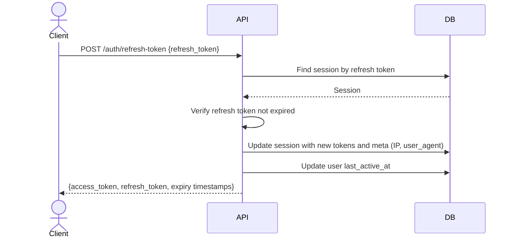
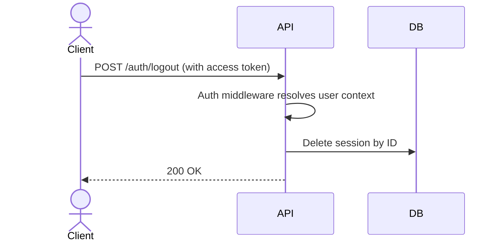
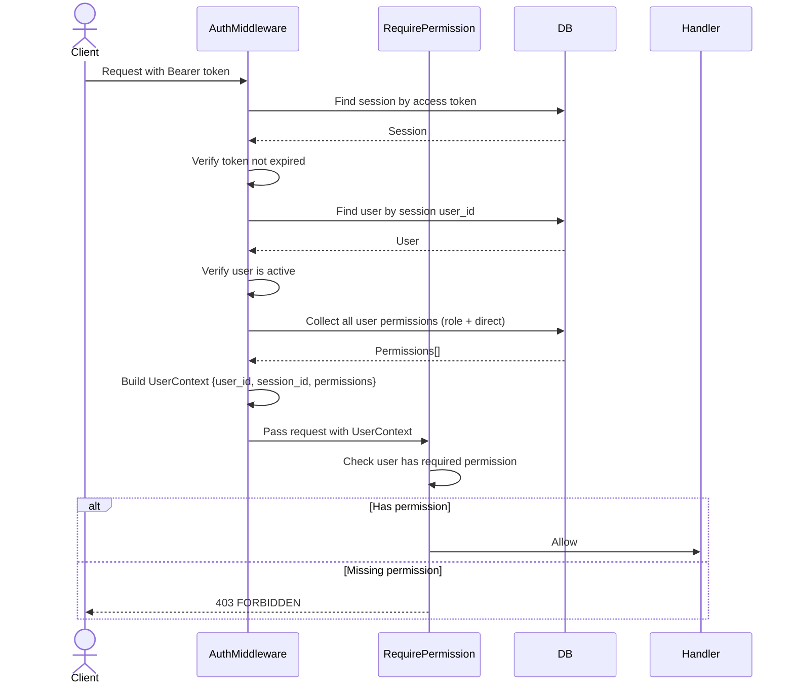

# Authentication & Authorization

## Overview

The system uses token-based authentication with session-backed access and refresh tokens, combined with Role-Based Access Control (RBAC) for authorization. There are no magic bypasses — every user, including the superadmin, is authorized through explicitly assigned permissions.

The authentication described here covers the **admin panel** only (username + password login). User-facing authentication (e.g., OTP, OAuth, SSO) is outside the scope of this blueprint and is implemented by derived projects.

## Authentication

### Admin Login

- Access token TTL: 15 minutes (default)
- Refresh token TTL: 30 days (default)
- Max active sessions per user: 5 (default) — on login, least recently used sessions are evicted if the limit is exceeded

### Token Refresh

Both tokens are rotated on each refresh — the old tokens become invalid.

### Logout

### Session Cleanup

Expired sessions (where the refresh token has expired) are deleted hourly by the `clean-expired-sessions` async task.

### User-Facing Authentication

<!-- TODO: Derived project — document your user-facing authentication flow here.
     Examples: OTP via SMS/email, OAuth 2.0, SSO, magic links, etc.
     Describe: login flow, identity verification steps, session creation, token format differences (if any). -->

_Not provided by the blueprint. Implement in derived project._

## Authorization

### Request Authorization (Middleware)

Every authenticated request goes through a two-step middleware pipeline:

**Route protection levels:**

| Level            | Middleware                             | Example endpoints                     |
| ---------------- | -------------------------------------- | ------------------------------------- |
| Unauthenticated  | None                                   | `admin-login`, `refresh-token`        |
| Authenticated    | `AuthMiddleware`                       | `logout`, `get-my-sessions`           |
| Permission-gated | `AuthMiddleware` + `RequirePermission` | `create-user`, `set-role-permissions` |

**RequirePermission behavior:**

- Accepts one or more permissions as arguments — grants access if the user has **at least one** (OR logic)
- For AND logic, chain multiple `RequirePermission` middleware calls on the same route

## RBAC

### Model

Permissions are flat strings following a `module:resource:action` convention (e.g., `auth:user:manage`). There is no hierarchy — `auth:user:manage` does not imply `auth:user:read`.

See [Auth Module ERD](../modules/auth/ERD.md) for entity relationships.

### Permission Sources

A user's effective permissions come from two sources, merged via SQL `UNION`:

1. **Role permissions** — permissions inherited from assigned roles (`user_roles` → `role_permissions`)
2. **Direct permissions** — permissions assigned directly to the user (`user_permissions`)

Duplicates are eliminated by the `UNION`. The merged set is loaded into `UserContext.Permissions` on every authenticated request.

### Superadmin

The superadmin is created via CLI (`./app auth create-superadmin`) during initial system bootstrap. It receives all permissions as **direct user permissions** — there is no special "superadmin" flag or role bypass. The superadmin is authorized through the same permission checks as any other user.

When new permissions are added to the system, they must be added to the `SuperadminPermissions()` list and re-assigned.
