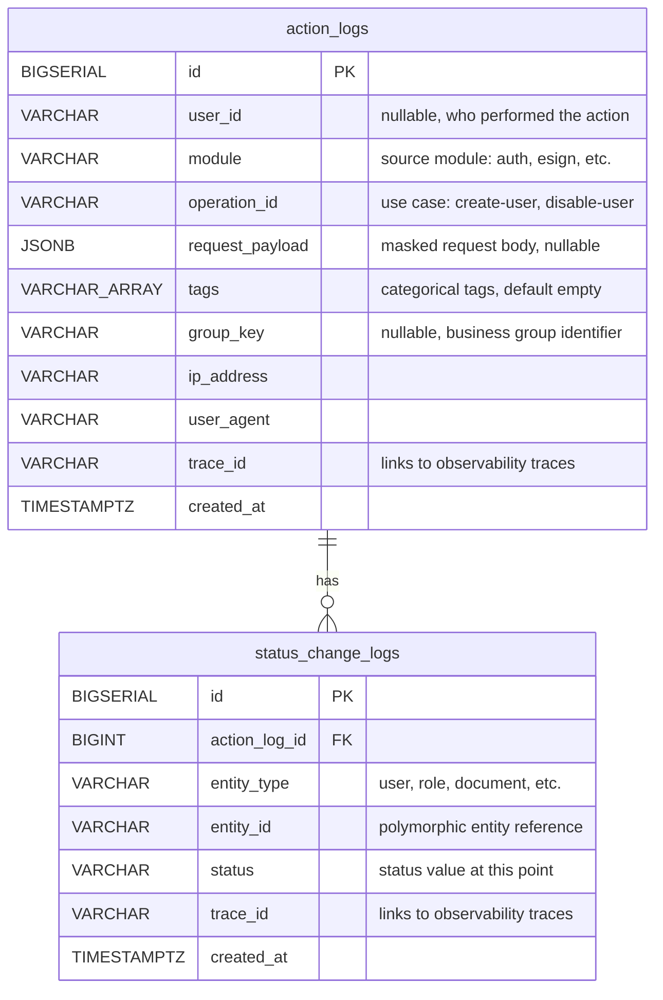

# Audit Module ERD

```mermaid
erDiagram
    action_logs ||--o{ status_change_logs : "has"

    action_logs {
        BIGSERIAL id PK
        VARCHAR user_id "nullable, who performed the action"
        VARCHAR module "source module: auth, esign, etc."
        VARCHAR operation_id "use case: create-user, disable-user"
        JSONB request_payload "masked request body, nullable"
        VARCHAR_ARRAY tags "categorical tags, default empty"
        VARCHAR group_key "nullable, business group identifier"
        VARCHAR ip_address
        VARCHAR user_agent
        VARCHAR trace_id "links to observability traces"
        TIMESTAMPTZ created_at
    }

    status_change_logs {
        BIGSERIAL id PK
        BIGINT action_log_id FK
        VARCHAR entity_type "user, role, document, etc."
        VARCHAR entity_id "polymorphic entity reference"
        VARCHAR status "status value at this point"
        VARCHAR trace_id "links to observability traces"
        TIMESTAMPTZ created_at
    }
```

Both tables: range-partitioned by `created_at` (monthly), no `updated_at`.
