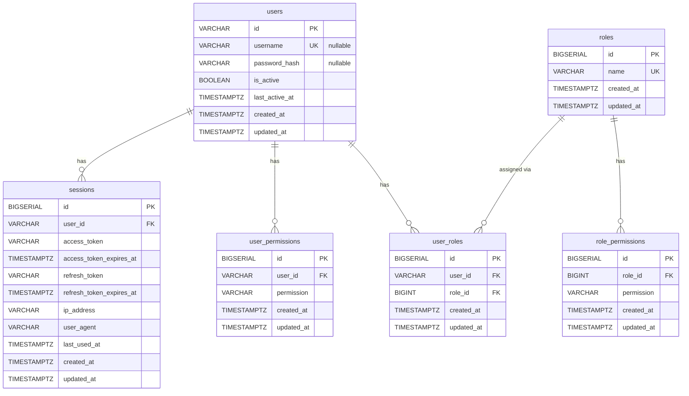

# Auth Module ERD

```mermaid
erDiagram
    users {
        VARCHAR id PK
        VARCHAR username UK "nullable"
        VARCHAR password_hash "nullable"
        BOOLEAN is_active
        TIMESTAMPTZ last_active_at
        TIMESTAMPTZ created_at
        TIMESTAMPTZ updated_at
    }

    roles {
        BIGSERIAL id PK
        VARCHAR name UK
        TIMESTAMPTZ created_at
        TIMESTAMPTZ updated_at
    }

    role_permissions {
        BIGSERIAL id PK
        BIGINT role_id FK
        VARCHAR permission
        TIMESTAMPTZ created_at
        TIMESTAMPTZ updated_at
    }

    user_roles {
        BIGSERIAL id PK
        VARCHAR user_id FK
        BIGINT role_id FK
        TIMESTAMPTZ created_at
        TIMESTAMPTZ updated_at
    }

    user_permissions {
        BIGSERIAL id PK
        VARCHAR user_id FK
        VARCHAR permission
        TIMESTAMPTZ created_at
        TIMESTAMPTZ updated_at
    }

    sessions {
        BIGSERIAL id PK
        VARCHAR user_id FK
        VARCHAR access_token
        TIMESTAMPTZ access_token_expires_at
        VARCHAR refresh_token
        TIMESTAMPTZ refresh_token_expires_at
        VARCHAR ip_address
        VARCHAR user_agent
        TIMESTAMPTZ last_used_at
        TIMESTAMPTZ created_at
        TIMESTAMPTZ updated_at
    }

    users ||--o{ user_roles : "has"
    users ||--o{ user_permissions : "has"
    users ||--o{ sessions : "has"
    roles ||--o{ role_permissions : "has"
    roles ||--o{ user_roles : "assigned via"
```
