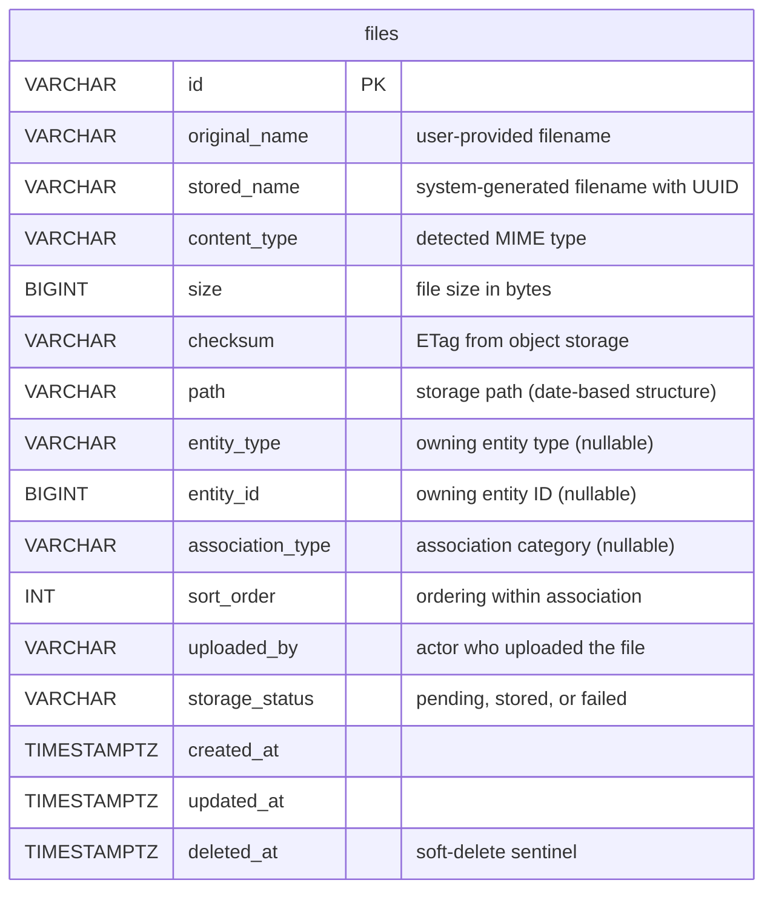

# Filevault Module - ERD

## Schema

The files table resides in the `filevault` schema: `filevault.files`

## Storage Status Values

| Status | Description |
| ------ | ----------- |
| `pending` | File record created, upload to object storage in progress |
| `stored` | File successfully uploaded to object storage |
| `failed` | Upload to object storage failed |

## Entity Association

Files use a polymorphic association pattern:
- `entity_type` identifies the type of entity (e.g., "user", "product")
- `entity_id` identifies the specific entity instance
- `association_type` categorizes the relationship (e.g., "avatar", "document", "gallery")

A file with `entity_id = NULL` is considered unattached and cannot be downloaded.

## Soft Delete

Files are soft-deleted by setting `deleted_at`. Soft-deleted files:
- Are excluded from normal queries
- Cannot be attached to entities
- Retain their storage path for potential cleanup jobs
