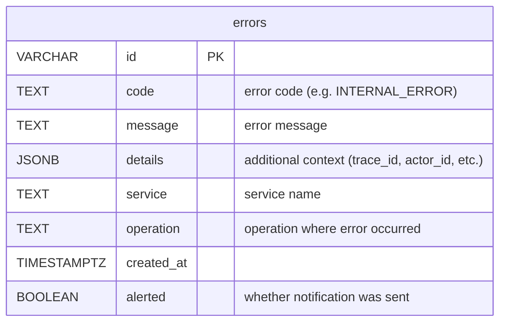

# Platform Module ERD

The platform module does not own any domain entities. It operates on Taskmill infrastructure tables (`taskmill.task_queue`, `taskmill.task_results`, `taskmill.task_schedules`) via the `console` package.

The `errors` table is managed by `rise-and-shine/pkg/observability/alert`. Platform module has read-only + delete access.

