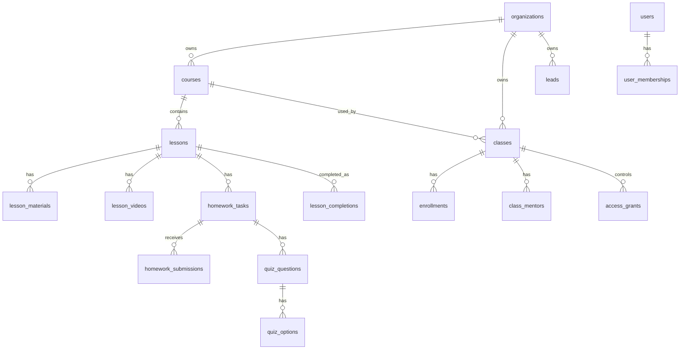

# Teknik Dokumantasyon

Bu dokuman Sinfim.uz projesinin ilk teknik sozlesme taslagidir.

Kural: Implementation baslamadan once her kritik use case icin ayrica UC dokumani yazilacak. Bu dosya modul, data model ve API yuzeyini netlestirmek icindir.

## Proje Bilgisi

| Alan | Karar |
|------|-------|
| Proje | Sinfim.uz / Online School Platform |
| Backend | Go - `go-enterprise-blueprint-main` |
| Frontend | Vue 3 + TypeScript - `vue-blueprint-web` |
| Database | PostgreSQL, tum timestamp alanlari `timestamptz` |
| Auth | Telefon raqami + password, SMS OTP yok, Telegram login yok |
| Tenant modeli | Multi-tenant organization |
| Organization URL | `sinfim.uz/{school-slug}` |
| Video | MVP'de Telegram stream referansi |
| Payment | MVP'de disarida; platformda manuel access/payment tasdigi |
| Deploy | Karar bekliyor |

## 0.1 Teknik MVP Kararlari

| Konu | Karar | Neden |
|------|-------|-------|
| Modul ayrimi | `homework` ve `learning` ayri modul kalacak | Domain ayrimi temiz; mentor review ile student read model karismasin |
| File upload | Storage abstraction kullanilacak; development'ta local disk, production'da S3-compatible storage hedeflenecek | MVP'de hizli baslanir, sonra MinIO/S3/R2 gibi servislere tasinabilir |
| Access granularity | MVP'de class-level access ana kural olacak; lesson/material-level kilit sadece publish schedule ile yonetilecek | Odeme/access operasyonunu basit tutar; ders bazli access daha sonra eklenebilir |
| Video | Telegram stream referansi saklanacak; dosya upload/transcoding yok | Mevcut teknik ortakliktan faydalanir, MVP hizlanir |
| Quiz answer storage | MVP'de normalized question/option + attempt tutulacak; detayli per-answer tablo sonraya kalabilir | Otomatik puanlama icin yeterli, fazla tabloyla baslamaz |

## 1. Modul Listesi

| Modul | Sorumlulugu | Bagli Moduller |
|-------|-------------|----------------|
| `auth` | Kullanici, rol, login/session, first-login password flow | `organization` |
| `organization` | Okul/brand, slug, public page, superadmin organization creation | `auth` |
| `catalog` | Course, lesson, material, lesson publish rules | `organization` |
| `classroom` | Class/group, mentor assignment, student enrollment, schedule, access/payment status | `organization`, `catalog`, `auth` |
| `homework` | Homework definitions, submissions, mentor review, quiz attempts | `catalog`, `classroom`, `auth` |
| `lead` | Public lead form, lead list, lead-to-student conversion | `organization`, `classroom` |
| `learning` | Student dashboard, lesson detail, student-facing progress | `catalog`, `classroom`, `homework` |
| `demo` | Demo school data/read-only demo flows | `organization`, `catalog`, `classroom`, `learning` |

MVP icin en kritik moduller:

1. `auth`
2. `organization`
3. `catalog`
4. `classroom`
5. `homework`
6. `lead`
7. `learning`

Karar: Moduller simdilik ayri kalacak. `homework` ve `learning` MVP'de birlestirilmeyecek.

- `homework` mentor operasyonu ve submission/review kurallarini sahiplenir.
- `learning` student-facing read model ve ders deneyimini sahiplenir.
- Ayrim UI ve domain olarak dogal; ileride test/quiz, progress ve feedback buyudugunde kodun karismasini engeller.
- Implementation sirasinda scope yine dar tutulacak: once minimal use case'ler yazilacak, tum modul ozellikleri ayni anda bitirilmeyecek.

## 2. Data Model Kararlari

### Genel Kurallar

- Her tablo: `id UUID PRIMARY KEY DEFAULT gen_random_uuid()`.
- Her ana tabloda: `created_at timestamptz DEFAULT NOW() NOT NULL`, `updated_at timestamptz DEFAULT NOW() NOT NULL`.
- Soft delete gereken tablolarda: `deleted_at timestamptz NULL`.
- Tenant izolasyonu icin tenant'a ait her tabloda `organization_id UUID NOT NULL`.
- Cross-module join implementation'da dikkatli ele alinacak; module ownership korunacak.
- Status ve type alanlari ilk MVP'de `VARCHAR` olarak tutulabilir, domain tarafinda enum/value object olarak kontrol edilir.

### Modul: `auth`

Ana entity'ler:

- `users`
- `user_memberships`
- `sessions`

Roller:

- `PLATFORM_ADMIN`
- `OWNER`
- `TEACHER`
- `MENTOR`
- `STUDENT`

```sql
CREATE SCHEMA IF NOT EXISTS auth;

CREATE TABLE auth.users (
    id                    UUID PRIMARY KEY DEFAULT gen_random_uuid(),
    phone_number          VARCHAR(32) UNIQUE NOT NULL,
    full_name             VARCHAR(255) NOT NULL,
    password_hash         VARCHAR(255) NOT NULL,
    is_active             BOOLEAN DEFAULT true NOT NULL,
    must_change_password  BOOLEAN DEFAULT false NOT NULL,
    last_active_at        timestamptz,
    created_at            timestamptz DEFAULT NOW() NOT NULL,
    updated_at            timestamptz DEFAULT NOW() NOT NULL,
    deleted_at            timestamptz NULL
);

CREATE TABLE auth.user_memberships (
    id               UUID PRIMARY KEY DEFAULT gen_random_uuid(),
    user_id          UUID NOT NULL,
    organization_id  UUID NULL,
    role             VARCHAR(32) NOT NULL,
    is_active        BOOLEAN DEFAULT true NOT NULL,
    created_at       timestamptz DEFAULT NOW() NOT NULL,
    updated_at       timestamptz DEFAULT NOW() NOT NULL
);

CREATE TABLE auth.sessions (
    id                       UUID PRIMARY KEY DEFAULT gen_random_uuid(),
    user_id                  UUID NOT NULL,
    access_token             VARCHAR(512) NOT NULL,
    refresh_token            VARCHAR(512) NOT NULL,
    access_token_expires_at  timestamptz NOT NULL,
    refresh_token_expires_at timestamptz NOT NULL,
    created_at               timestamptz DEFAULT NOW() NOT NULL
);
```

### Modul: `organization`

Ana entity'ler:

- `organizations`
- `school_requests`

```sql
CREATE SCHEMA IF NOT EXISTS organization;

CREATE TABLE organization.organizations (
    id              UUID PRIMARY KEY DEFAULT gen_random_uuid(),
    name            VARCHAR(255) NOT NULL,
    slug            VARCHAR(128) UNIQUE NOT NULL,
    description     TEXT,
    logo_url        TEXT,
    category        VARCHAR(128),
    contact_phone   VARCHAR(32),
    telegram_url    TEXT,
    public_status   VARCHAR(32) DEFAULT 'draft' NOT NULL,
    is_demo         BOOLEAN DEFAULT false NOT NULL,
    created_at      timestamptz DEFAULT NOW() NOT NULL,
    updated_at      timestamptz DEFAULT NOW() NOT NULL,
    deleted_at      timestamptz NULL
);

CREATE TABLE organization.school_requests (
    id             UUID PRIMARY KEY DEFAULT gen_random_uuid(),
    full_name      VARCHAR(255) NOT NULL,
    phone_number   VARCHAR(32) NOT NULL,
    school_name    VARCHAR(255) NOT NULL,
    category       VARCHAR(128),
    student_count  INTEGER,
    note           TEXT,
    status         VARCHAR(32) DEFAULT 'new' NOT NULL,
    created_at     timestamptz DEFAULT NOW() NOT NULL,
    updated_at     timestamptz DEFAULT NOW() NOT NULL
);
```

### Modul: `catalog`

Course = reusable content package.

Ana entity'ler:

- `courses`
- `lessons`
- `lesson_materials`
- `lesson_videos`

```sql
CREATE SCHEMA IF NOT EXISTS catalog;

CREATE TABLE catalog.courses (
    id               UUID PRIMARY KEY DEFAULT gen_random_uuid(),
    organization_id  UUID NOT NULL,
    title            VARCHAR(255) NOT NULL,
    slug             VARCHAR(128) NOT NULL,
    description      TEXT,
    category         VARCHAR(128),
    level            VARCHAR(64),
    status           VARCHAR(32) DEFAULT 'draft' NOT NULL,
    public_status    VARCHAR(32) DEFAULT 'draft' NOT NULL,
    created_at       timestamptz DEFAULT NOW() NOT NULL,
    updated_at       timestamptz DEFAULT NOW() NOT NULL,
    deleted_at       timestamptz NULL,
    UNIQUE (organization_id, slug)
);

CREATE TABLE catalog.lessons (
    id               UUID PRIMARY KEY DEFAULT gen_random_uuid(),
    organization_id  UUID NOT NULL,
    course_id        UUID NOT NULL,
    title            VARCHAR(255) NOT NULL,
    description      TEXT,
    order_number     INTEGER NOT NULL,
    estimated_minutes INTEGER,
    status           VARCHAR(32) DEFAULT 'draft' NOT NULL,
    publish_day      INTEGER,
    created_at       timestamptz DEFAULT NOW() NOT NULL,
    updated_at       timestamptz DEFAULT NOW() NOT NULL,
    deleted_at       timestamptz NULL
);

CREATE TABLE catalog.lesson_videos (
    id                  UUID PRIMARY KEY DEFAULT gen_random_uuid(),
    organization_id     UUID NOT NULL,
    lesson_id           UUID NOT NULL,
    provider            VARCHAR(32) DEFAULT 'telegram' NOT NULL,
    telegram_channel_id VARCHAR(255),
    telegram_message_id VARCHAR(255),
    stream_ref          TEXT NOT NULL,
    duration_seconds    INTEGER,
    created_at          timestamptz DEFAULT NOW() NOT NULL,
    updated_at          timestamptz DEFAULT NOW() NOT NULL
);

CREATE TABLE catalog.lesson_materials (
    id               UUID PRIMARY KEY DEFAULT gen_random_uuid(),
    organization_id  UUID NOT NULL,
    lesson_id        UUID NOT NULL,
    title            VARCHAR(255) NOT NULL,
    material_type    VARCHAR(32) NOT NULL,
    file_url         TEXT,
    external_url     TEXT,
    file_size_bytes  BIGINT,
    order_number     INTEGER DEFAULT 1 NOT NULL,
    created_at       timestamptz DEFAULT NOW() NOT NULL,
    updated_at       timestamptz DEFAULT NOW() NOT NULL
);
```

### Modul: `classroom`

Class/Group = live cohort operation.

Ana entity'ler:

- `classes`
- `class_mentors`
- `enrollments`
- `access_grants`

```sql
CREATE SCHEMA IF NOT EXISTS classroom;

CREATE TABLE classroom.classes (
    id               UUID PRIMARY KEY DEFAULT gen_random_uuid(),
    organization_id  UUID NOT NULL,
    course_id        UUID NOT NULL,
    name             VARCHAR(255) NOT NULL,
    start_date       DATE,
    lesson_cadence   VARCHAR(32) DEFAULT 'every_other_day' NOT NULL,
    status           VARCHAR(32) DEFAULT 'active' NOT NULL,
    created_at       timestamptz DEFAULT NOW() NOT NULL,
    updated_at       timestamptz DEFAULT NOW() NOT NULL,
    deleted_at       timestamptz NULL
);

CREATE TABLE classroom.class_mentors (
    id               UUID PRIMARY KEY DEFAULT gen_random_uuid(),
    organization_id  UUID NOT NULL,
    class_id         UUID NOT NULL,
    mentor_user_id   UUID NOT NULL,
    created_at       timestamptz DEFAULT NOW() NOT NULL,
    updated_at       timestamptz DEFAULT NOW() NOT NULL,
    UNIQUE (class_id, mentor_user_id)
);

CREATE TABLE classroom.enrollments (
    id               UUID PRIMARY KEY DEFAULT gen_random_uuid(),
    organization_id  UUID NOT NULL,
    class_id         UUID NOT NULL,
    student_user_id  UUID NOT NULL,
    status           VARCHAR(32) DEFAULT 'active' NOT NULL,
    enrolled_at      timestamptz DEFAULT NOW() NOT NULL,
    created_at       timestamptz DEFAULT NOW() NOT NULL,
    updated_at       timestamptz DEFAULT NOW() NOT NULL,
    UNIQUE (class_id, student_user_id)
);

CREATE TABLE classroom.access_grants (
    id               UUID PRIMARY KEY DEFAULT gen_random_uuid(),
    organization_id  UUID NOT NULL,
    class_id         UUID NOT NULL,
    student_user_id  UUID NOT NULL,
    access_status    VARCHAR(32) DEFAULT 'pending' NOT NULL,
    payment_status   VARCHAR(32) DEFAULT 'unknown' NOT NULL,
    note             TEXT,
    granted_by       UUID,
    granted_at       timestamptz,
    created_at       timestamptz DEFAULT NOW() NOT NULL,
    updated_at       timestamptz DEFAULT NOW() NOT NULL,
    UNIQUE (class_id, student_user_id)
);
```

### Modul: `homework`

Ana entity'ler:

- `homework_tasks`
- `homework_submissions`
- `quiz_questions`
- `quiz_options`
- `quiz_attempts`

```sql
CREATE SCHEMA IF NOT EXISTS homework;

CREATE TABLE homework.homework_tasks (
    id               UUID PRIMARY KEY DEFAULT gen_random_uuid(),
    organization_id  UUID NOT NULL,
    lesson_id        UUID NOT NULL,
    title            VARCHAR(255) NOT NULL,
    instructions     TEXT,
    homework_type    VARCHAR(32) NOT NULL,
    due_days_after_publish INTEGER,
    is_required      BOOLEAN DEFAULT true NOT NULL,
    created_at       timestamptz DEFAULT NOW() NOT NULL,
    updated_at       timestamptz DEFAULT NOW() NOT NULL,
    deleted_at       timestamptz NULL
);

CREATE TABLE homework.homework_submissions (
    id               UUID PRIMARY KEY DEFAULT gen_random_uuid(),
    organization_id  UUID NOT NULL,
    homework_task_id UUID NOT NULL,
    class_id         UUID NOT NULL,
    student_user_id  UUID NOT NULL,
    submission_type  VARCHAR(32) NOT NULL,
    text_answer      TEXT,
    file_url         TEXT,
    audio_url        TEXT,
    status           VARCHAR(32) DEFAULT 'submitted' NOT NULL,
    score            INTEGER,
    feedback         TEXT,
    reviewed_by      UUID,
    reviewed_at      timestamptz,
    submitted_at     timestamptz DEFAULT NOW() NOT NULL,
    created_at       timestamptz DEFAULT NOW() NOT NULL,
    updated_at       timestamptz DEFAULT NOW() NOT NULL
);

CREATE TABLE homework.quiz_questions (
    id               UUID PRIMARY KEY DEFAULT gen_random_uuid(),
    organization_id  UUID NOT NULL,
    homework_task_id UUID NOT NULL,
    question_text    TEXT NOT NULL,
    question_type    VARCHAR(32) DEFAULT 'single_choice' NOT NULL,
    order_number     INTEGER NOT NULL,
    created_at       timestamptz DEFAULT NOW() NOT NULL,
    updated_at       timestamptz DEFAULT NOW() NOT NULL
);

CREATE TABLE homework.quiz_options (
    id               UUID PRIMARY KEY DEFAULT gen_random_uuid(),
    organization_id  UUID NOT NULL,
    question_id      UUID NOT NULL,
    option_text      TEXT NOT NULL,
    is_correct       BOOLEAN DEFAULT false NOT NULL,
    order_number     INTEGER NOT NULL,
    created_at       timestamptz DEFAULT NOW() NOT NULL,
    updated_at       timestamptz DEFAULT NOW() NOT NULL
);

CREATE TABLE homework.quiz_attempts (
    id               UUID PRIMARY KEY DEFAULT gen_random_uuid(),
    organization_id  UUID NOT NULL,
    homework_task_id UUID NOT NULL,
    class_id         UUID NOT NULL,
    student_user_id  UUID NOT NULL,
    score            INTEGER NOT NULL,
    max_score        INTEGER NOT NULL,
    submitted_at     timestamptz DEFAULT NOW() NOT NULL,
    created_at       timestamptz DEFAULT NOW() NOT NULL
);
```

### Modul: `lead`

Ana entity'ler:

- `leads`

```sql
CREATE SCHEMA IF NOT EXISTS lead;

CREATE TABLE lead.leads (
    id               UUID PRIMARY KEY DEFAULT gen_random_uuid(),
    organization_id  UUID NOT NULL,
    course_id        UUID,
    full_name        VARCHAR(255) NOT NULL,
    phone_number     VARCHAR(32) NOT NULL,
    note             TEXT,
    status           VARCHAR(32) DEFAULT 'new' NOT NULL,
    source_page      TEXT,
    converted_user_id UUID,
    converted_at     timestamptz,
    created_at       timestamptz DEFAULT NOW() NOT NULL,
    updated_at       timestamptz DEFAULT NOW() NOT NULL
);
```

### Modul: `learning`

Ana entity'ler:

- `lesson_completions`

```sql
CREATE SCHEMA IF NOT EXISTS learning;

CREATE TABLE learning.lesson_completions (
    id               UUID PRIMARY KEY DEFAULT gen_random_uuid(),
    organization_id  UUID NOT NULL,
    class_id         UUID NOT NULL,
    lesson_id        UUID NOT NULL,
    student_user_id  UUID NOT NULL,
    completed_at     timestamptz DEFAULT NOW() NOT NULL,
    created_at       timestamptz DEFAULT NOW() NOT NULL,
    UNIQUE (class_id, lesson_id, student_user_id)
);
```

## 3. ERD Taslagi



## 4. API Contract Kurallari

- REST degil, operation endpoint modeli.
- GET = query operations.
- POST = mutation operations.
- PUT/PATCH/DELETE yok.
- Path parameter yok; ID'ler query veya body icinde.
- Endpoint formati: `/api/v1/{module}/{operation-id}`.
- Error response: `trace_id` + `error.code/message/cause`.
- Her response'ta `X-Trace-ID`.

## 5. Use Case Listesi

### Modul: `auth`

| Operation ID | Method | Path | Actor | Aciklama |
|--------------|--------|------|-------|----------|
| `login` | POST | `/api/v1/auth/login` | Public | Telefon + password ile giris |
| `logout` | POST | `/api/v1/auth/logout` | Authenticated | Session kapat |
| `refresh-token` | POST | `/api/v1/auth/refresh-token` | Public | Token yenile |
| `get-me` | GET | `/api/v1/auth/get-me` | Authenticated | Mevcut kullanici ve membership bilgisi |
| `change-initial-password` | POST | `/api/v1/auth/change-initial-password` | Authenticated | Ilk giriste password belirle |
| `create-temp-password` | POST | `/api/v1/auth/create-temp-password` | Owner/Mentor/Superadmin | Kullanici icin gecici password/kod uret |

### Modul: `organization`

| Operation ID | Method | Path | Actor | Aciklama |
|--------------|--------|------|-------|----------|
| `create-organization` | POST | `/api/v1/organization/create-organization` | Platform Admin | Okul/organization olustur |
| `update-organization` | POST | `/api/v1/organization/update-organization` | Owner | Okul bilgilerini guncelle |
| `get-organization` | GET | `/api/v1/organization/get-organization` | Owner | Organization detayini getir |
| `get-public-school-page` | GET | `/api/v1/organization/get-public-school-page` | Public | Slug ile public okul sayfasi |
| `create-school-request` | POST | `/api/v1/organization/create-school-request` | Public | Platforma katilma talebi |
| `list-school-requests` | GET | `/api/v1/organization/list-school-requests` | Platform Admin | Okul talepleri listesi |

### Modul: `catalog`

| Operation ID | Method | Path | Actor | Aciklama |
|--------------|--------|------|-------|----------|
| `create-course` | POST | `/api/v1/catalog/create-course` | Owner/Teacher | Kurs olustur |
| `update-course` | POST | `/api/v1/catalog/update-course` | Owner/Teacher | Kurs guncelle |
| `list-courses` | GET | `/api/v1/catalog/list-courses` | Owner/Teacher | Kurslari listele |
| `get-course-detail` | GET | `/api/v1/catalog/get-course-detail` | Owner/Teacher | Kurs detay |
| `create-lesson` | POST | `/api/v1/catalog/create-lesson` | Owner/Teacher | Ders olustur |
| `update-lesson` | POST | `/api/v1/catalog/update-lesson` | Owner/Teacher | Ders editor kaydet |
| `list-lessons` | GET | `/api/v1/catalog/list-lessons` | Owner/Teacher | Kurs dersleri |
| `get-public-course-page` | GET | `/api/v1/catalog/get-public-course-page` | Public | Public kurs sayfasi |

### Modul: `classroom`

| Operation ID | Method | Path | Actor | Aciklama |
|--------------|--------|------|-------|----------|
| `create-class` | POST | `/api/v1/classroom/create-class` | Owner/Teacher | Sinif/grup olustur |
| `update-class` | POST | `/api/v1/classroom/update-class` | Owner/Teacher | Sinif/grup guncelle |
| `get-class-detail` | GET | `/api/v1/classroom/get-class-detail` | Owner/Teacher/Mentor | Sinif/grup operasyon detayi |
| `list-classes` | GET | `/api/v1/classroom/list-classes` | Owner/Teacher/Mentor | Sinif/grup listesi |
| `assign-mentor` | POST | `/api/v1/classroom/assign-mentor` | Owner/Teacher | Mentoru sinifa ata |
| `add-student` | POST | `/api/v1/classroom/add-student` | Owner/Teacher/Mentor | Telefon ile ogrenci ekle |
| `update-access` | POST | `/api/v1/classroom/update-access` | Owner/Teacher/Mentor | Ogrencinin access/payment durumunu guncelle |
| `list-students` | GET | `/api/v1/classroom/list-students` | Owner/Teacher/Mentor | Sinif ogrencileri |

### Modul: `homework`

| Operation ID | Method | Path | Actor | Aciklama |
|--------------|--------|------|-------|----------|
| `create-homework-task` | POST | `/api/v1/homework/create-homework-task` | Owner/Teacher | Ders icin odev olustur |
| `update-homework-task` | POST | `/api/v1/homework/update-homework-task` | Owner/Teacher | Odev guncelle |
| `submit-homework` | POST | `/api/v1/homework/submit-homework` | Student | Yazili/dosya/audio odev teslimi |
| `submit-quiz` | POST | `/api/v1/homework/submit-quiz` | Student | Quiz/test cevaplari |
| `list-submissions` | GET | `/api/v1/homework/list-submissions` | Mentor/Owner/Teacher | Odev inbox/listesi |
| `review-submission` | POST | `/api/v1/homework/review-submission` | Mentor/Owner/Teacher | Feedback/puan/durum gir |

### Modul: `lead`

| Operation ID | Method | Path | Actor | Aciklama |
|--------------|--------|------|-------|----------|
| `create-lead` | POST | `/api/v1/lead/create-lead` | Public | Public okul/kurs formundan lead |
| `list-leads` | GET | `/api/v1/lead/list-leads` | Owner/Teacher/Mentor | Lead listesi |
| `convert-lead-to-student` | POST | `/api/v1/lead/convert-lead-to-student` | Owner/Teacher/Mentor | Lead'i student'a cevir |
| `update-lead-status` | POST | `/api/v1/lead/update-lead-status` | Owner/Teacher/Mentor | Lead durumunu guncelle |

### Modul: `learning`

| Operation ID | Method | Path | Actor | Aciklama |
|--------------|--------|------|-------|----------|
| `get-student-dashboard` | GET | `/api/v1/learning/get-student-dashboard` | Student | Bugunku dersler, odevler, progress |
| `get-lesson-detail` | GET | `/api/v1/learning/get-lesson-detail` | Student | Ders video/material/odev detayi |
| `mark-lesson-completed` | POST | `/api/v1/learning/mark-lesson-completed` | Student | Dersi tamamlandi isaretle |

### Modul: `demo`

| Operation ID | Method | Path | Actor | Aciklama |
|--------------|--------|------|-------|----------|
| `get-demo-owner-dashboard` | GET | `/api/v1/demo/get-demo-owner-dashboard` | Public | Demo owner dashboard data |
| `get-demo-student-view` | GET | `/api/v1/demo/get-demo-student-view` | Public | Demo student experience data |

## 6. Error Code Katalogu

| Modul | Code | Tip | Aciklama |
|-------|------|-----|----------|
| auth | `INCORRECT_CREDENTIALS` | Validation | Telefon veya password hatali |
| auth | `USER_INACTIVE` | Validation | Kullanici pasif |
| auth | `MUST_CHANGE_PASSWORD` | Validation | Ilk giriste password degistirilmeli |
| organization | `ORGANIZATION_NOT_FOUND` | NotFound | Organization bulunamadi |
| organization | `SLUG_ALREADY_TAKEN` | Conflict | Slug kullaniliyor |
| catalog | `COURSE_NOT_FOUND` | NotFound | Kurs bulunamadi |
| catalog | `LESSON_NOT_FOUND` | NotFound | Ders bulunamadi |
| classroom | `CLASS_NOT_FOUND` | NotFound | Sinif/grup bulunamadi |
| classroom | `ACCESS_DENIED` | Forbidden | Access yok |
| classroom | `STUDENT_ALREADY_ENROLLED` | Conflict | Ogrenci zaten sinifta |
| homework | `HOMEWORK_NOT_FOUND` | NotFound | Odev bulunamadi |
| homework | `SUBMISSION_NOT_FOUND` | NotFound | Teslim bulunamadi |
| lead | `LEAD_NOT_FOUND` | NotFound | Lead bulunamadi |
| lead | `LEAD_ALREADY_CONVERTED` | Conflict | Lead zaten student'a cevrilmis |

## 7. Portal Arayuzleri

| Portal | Saglayan Modul | Kullanan Modul | Metodlar |
|--------|----------------|----------------|----------|
| `AuthPortal` | `auth` | `organization`, `classroom`, `homework` | `GetUser`, `CreateUserWithTempPassword`, `EnsureMembership` |
| `OrganizationPortal` | `organization` | tum tenant modulleri | `GetOrganization`, `ResolveBySlug`, `EnsureAccess` |
| `CatalogPortal` | `catalog` | `classroom`, `learning`, `homework` | `GetCourse`, `GetLesson`, `ListLessonsByCourse` |
| `ClassroomPortal` | `classroom` | `learning`, `homework`, `lead` | `GetEnrollment`, `EnsureStudentAccess`, `GetClass` |
| `HomeworkPortal` | `homework` | `learning` | `GetTaskForLesson`, `GetStudentSubmissionStatus` |

## 8. Frontend API Dosyalari

| Dosya | Sorumluluk |
|-------|------------|
| `src/api/auth.ts` | login, logout, get-me, change-initial-password |
| `src/api/organization.ts` | organization, public school page, school request |
| `src/api/catalog.ts` | courses, lessons, public course page |
| `src/api/classroom.ts` | classes, students, mentors, access |
| `src/api/homework.ts` | homework tasks, submissions, reviews, quiz |
| `src/api/leads.ts` | lead create/list/convert/status |
| `src/api/learning.ts` | student dashboard, lesson detail, completion |
| `src/api/demo.ts` | demo owner/student data |

## 9. Teknik Acik Sorular

- File upload karari: storage abstraction. Development'ta local disk, production'da S3-compatible storage hedeflenecek. Hangi provider daha sonra secilecek.
- Telegram stream referansi icin minimum metadata tam olarak ne olacak?
- Student first-login akisi: gecici password mu, invite link mi, tek kullanimlik kod mu?
- Quiz answers karari: MVP'de question/option + attempt yeterli; per-answer detay tablosu sonraya kalabilir.
- `users` tek tablo modeli MVP icin yeterli kabul edildi; student profilini ayri tabloya almak sonraya kalabilir.
- Access karari: MVP'de class-level access yeterli. Lesson/material-level kilit publish schedule ile yonetilecek.

## 10. Sonraki Adim

1. Bu teknik taslagi review et.
2. Ilk implementation sirasini uygula:
   - `auth`
   - `organization`
   - `catalog`
   - `classroom`
   - `lead`
   - `homework`
   - `learning`
3. Her kritik UC icin `docs/specs/modules/{module}/usecases/...` dokumani yaz.
